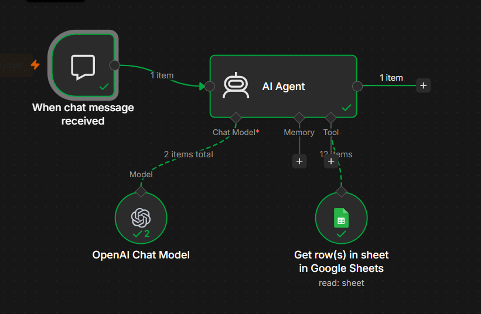
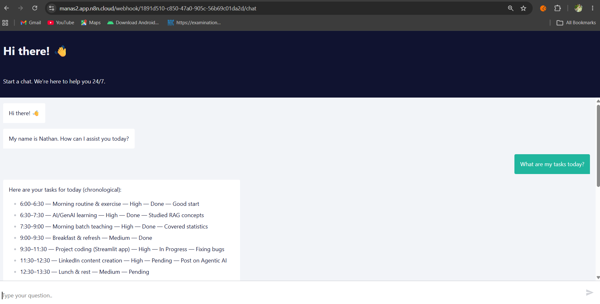

# 📅 AI Daily Planner Assistant using n8n

<p align="center">
  
</p>

<p align="center">
An AI-powered daily planner assistant built with <strong>n8n</strong>, <strong>OpenAI GPT-5 Mini</strong>, and <strong>Google Sheets</strong>.  
Chat with your planner in natural language and instantly retrieve your daily schedule, priorities, and task status.
</p>

---

## 🚀 Overview

This project demonstrates how to build an **AI-powered productivity assistant** using **n8n AI Agent**.

The workflow connects an **OpenAI Chat Model** with a **Google Sheets** planner, allowing users to ask questions like:

- What are my tasks today?
- What is my next task?
- Which tasks are pending?
- Show my high-priority work.

The AI Agent reads the planner directly from Google Sheets and responds with a structured, easy-to-read answer.

---

# ✨ Features

- 💬 Chat with your planner using natural language
- 🤖 AI-powered responses using OpenAI GPT-5 Mini
- 📊 Reads task data from Google Sheets
- 📅 Displays today's schedule
- ⭐ Identifies high-priority tasks
- ✅ Shows completed and pending work
- ⚡ Built entirely with n8n AI Agent

---

# 🛠 Tech Stack

| Technology | Purpose |
|------------|---------|
| n8n | Workflow Automation |
| OpenAI GPT-5 Mini | AI Chat Model |
| Google Sheets | Task Database |
| AI Agent | Intelligent Task Retrieval |

---

# 📂 Folder Structure

```text
02-ai-daily-planner/
│
├── assets/
│   └── daily planner.xlsx
│
├── screenshots/
│   ├── workflow.png
│   └── chat-demo.png
│
├── README.md
└── workflow.json
```

---

# 🔄 Workflow

```text
User Message
      │
      ▼
Chat Trigger
      │
      ▼
AI Agent
      │
 ┌────┴───────────┐
 │                │
 ▼                ▼
OpenAI GPT     Google Sheets
      │
      ▼
AI Response
```

---

# 📸 Workflow

<p align="center">

</p>

The workflow consists of:

1. Chat Trigger receives the user's message.
2. AI Agent understands the request.
3. Google Sheets provides planner data.
4. OpenAI GPT generates an intelligent response.
5. The chatbot returns a personalized answer.

---

# 📊 Google Sheet

The planner is maintained inside **Google Sheets**, making it easy to update tasks without modifying the workflow.

Example columns:

- Time
- Task
- Category
- Priority
- Status
- Notes

The spreadsheet template is available in:

```text
assets/daily planner.xlsx
```

---

# 💬 Chat Demo

Below is an example conversation with the AI Daily Planner Assistant.

<p align="center">

</p>

### Example Question

> What are my tasks today?

### Example Response

- 🕕 Morning routine & exercise
- 📚 AI/GenAI Learning
- 👨‍🏫 Morning batch teaching
- 🍳 Breakfast & Refresh
- 💻 Project Coding
- ✍️ LinkedIn Content Creation
- 🍽️ Lunch & Rest

The AI automatically reads the planner and presents today's schedule in a clear and organized format.

---

# 🚀 Getting Started

## 1. Import Workflow

Import the `workflow.json` file into n8n.

---

## 2. Configure Credentials

Add your credentials for:

- OpenAI
- Google Sheets

---

## 3. Upload Your Planner

Replace the sample planner with your own Google Sheet.

---

## 4. Start Chatting

Ask questions such as:

- What are my tasks today?
- What should I do next?
- Show pending work.
- Show completed tasks.
- Which tasks are high priority?
- Summarize today's schedule.

---

# 🎯 Skills Demonstrated

- n8n AI Agent
- Workflow Automation
- OpenAI Integration
- Google Sheets API
- Prompt Engineering
- Conversational AI
- Productivity Automation

---

# 🔮 Future Improvements

- 📅 Google Calendar Integration
- 📧 Gmail Daily Summary
- 📱 WhatsApp Notifications
- 💬 Telegram Bot
- 🧠 Memory Support
- 🎤 Voice Assistant
- 📊 Analytics Dashboard
- 🔔 Smart Task Reminders

---

# ⭐ Support

If you found this project useful, consider giving this repository a **⭐ Star** on GitHub.

---

## 👨‍💻 Author

**Manas Ranjan Meher**

- GitHub: https://github.com/manasranjanmeher99
- LinkedIn: [https://www.linkedin.com/in/manas-ranjan-meher](https://www.linkedin.com/in/manas-ranjan-meher-606181280/)

---

<p align="center">

### 🚀 Built with n8n + OpenAI + Google Sheets

**Automate your daily planning with AI.**

</p>
